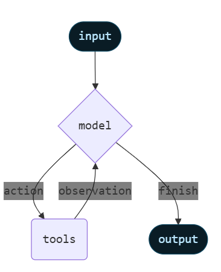
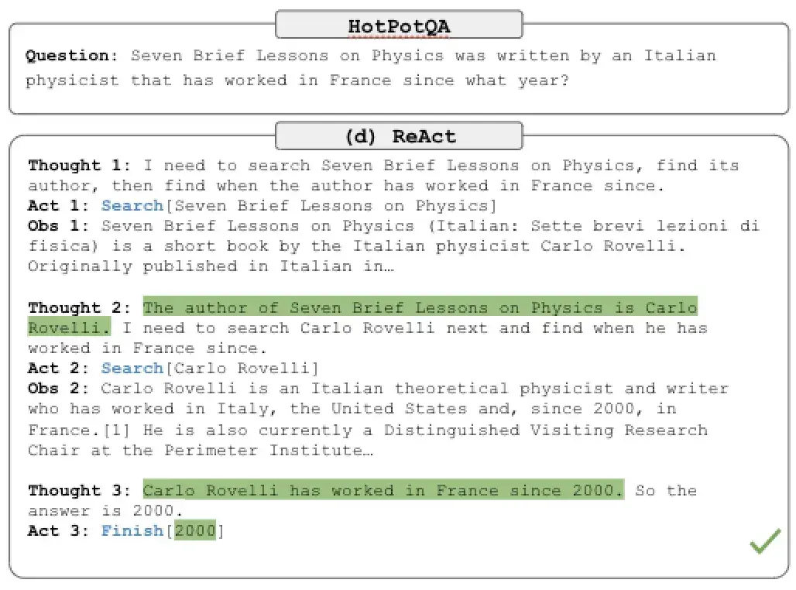
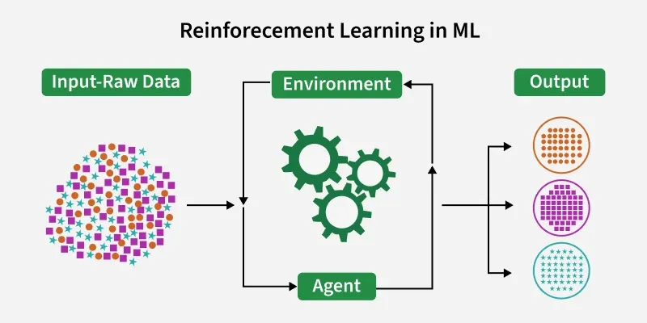
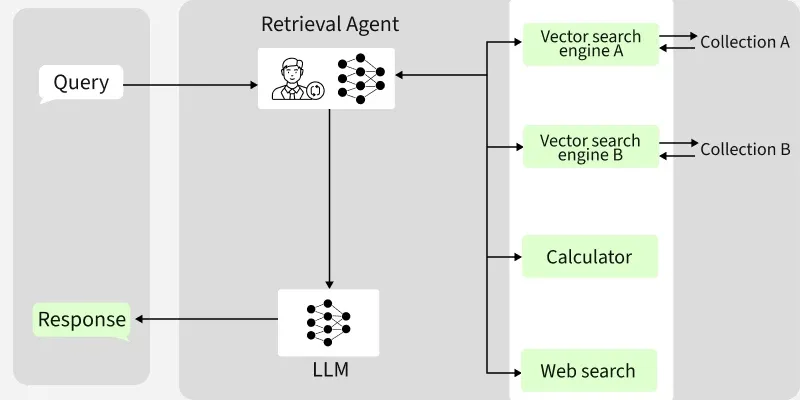
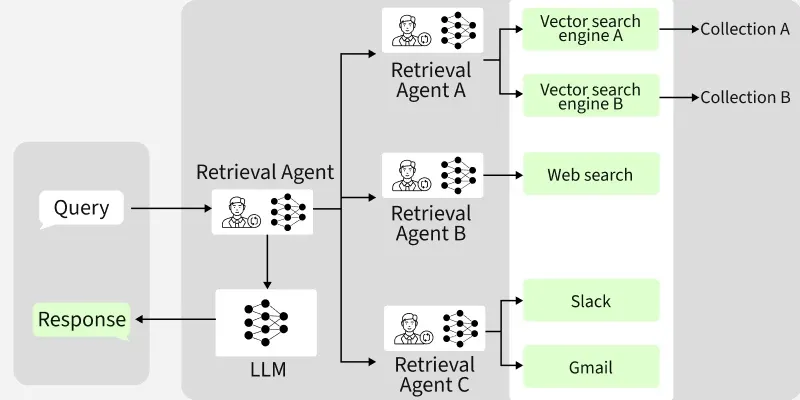
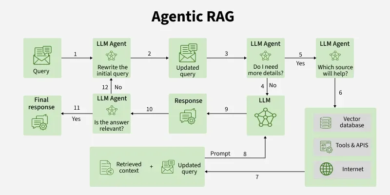

# Agent

- [Agent](#agent)
  - [What is AI Agent?](#what-is-ai-agent)
  - [LLM Using Tools](#llm-using-tools)
    - [What is a MRKL System?](#what-is-a-mrkl-system)
    - [Examples of MRKL Systems](#examples-of-mrkl-systems)
    - [Components](#components)
  - [LLMs that Reason and Act](#llms-that-reason-and-act)
    - [What is ReAct?](#what-is-react)
    - [Reinforcement Learning](#reinforcement-learning)
    - [Question](#question)
  - [Agentic RAG](#agentic-rag)
    - [Architecture of Agentic RAG](#architecture-of-agentic-rag)
      - [Single-Agent RAG](#single-agent-rag)
      - [Multi-Agent RAG](#multi-agent-rag)
    - [AI Agentic Orchestration](#ai-agentic-orchestration)
    - [Working of Agentic RAG](#working-of-agentic-rag)
    - [Agent Frameworks for Agentic RAG](#agent-frameworks-for-agentic-rag)

## What is AI Agent?

Agents are LLMs that can use external tools, such as APIs and databases, to incorporate information beyond the model's training and enhance problem-solving abilities.

One of the primary difference between Agents and LLMs is that Agents can **make decision** based on its input and surrounding environments. One example could be generating an answer for a question that is out side of LLM's knowledge. A typical LLM will make up the answer, while an Agents can call tools to perform an Internet search for the information, and then compose the final answer.

Let's take a look at this example of an Agent:

Prompt:

```text
What is 19 percent of 5619?
```

Output:

```text
CALCULATOR[(0.19) * (5619)]
```

Can you spot the reason why this is an output from Agents, not a LLM? Let's discuss your answer in class.

## LLM Using Tools

### What is a MRKL System?

Modular Reasoning, Knowledge, and Language or MRKL Systems (pronounced "miracle") are an architecture that combines Large Language Models (neural computation) with external tools like calculators to solve complex problems.

A MRKL system consists of a set of modules (e.g., a calculator, weather API, database) and a router that decides how to 'route' incoming natural language queries to the appropriate module.

A simple example of a MRKL system is an LLM that can use a calculator app. This is a single-module system, where the LLM acts as the router. When asked, "What is 100 \* 100?", the LLM extracts the numbers from the prompt and directs the MRKL system to use the calculator to compute the result, like this:

Prompt:

```text
What is 100 x 100?
```

Output:

```text
CALCULATOR[100 * 100]
```

### Examples of MRKL Systems

Consider the following additional examples of applications:

- **Financial Database Queries**: A chatbot can extract information from a user's text and form a SQL query to fetch the latest stock prices.
- **Weather Queries**: A chatbot can extract location data from a prompt and use a weather API to provide the current forecast.

### Components

An LLM Agent runs tools in a loop to achieve a goal. An agent runs until a stop condition is met - i.e., when the model emits a final output or an iteration limit is reached.

Below is the workflow of this process, taken from LangChain:



## LLMs that Reason and Act

ReAct Systems enhance MRKL frameworks by combining reasoning with actions, enabling LLMs to improve complex task performance through iterative thought-action loops.

### What is ReAct?

[ReAct (Reason and Act)](https://arxiv.org/abs/2210.03629) is a prompting technique that enables Large Language Models (LLMs) to solve complex tasks through natural language reasoning and actions. It allows an LLM to perform certain actions, such as retrieving external information, and then reason based on the retrieved data.

ReAct systems extend Modular Reasoning, Knowledge, and Language (MRKL) systems by adding the ability to reason about the actions they can perform.

Below is an example of [Hotpot2](https://arxiv.org/abs/1809.09600): a question-answering dataset requiring complex reasoning. ReAct allows the LLM to reason about the question (Thought 1), take actions (e.g., querying Google) (Act 1). It then receives an observation (Obs 1) and continues the thought-action loop until reaching a conclusion (Act 3).



This paradigm can be recognized as the same as Reinforcement Learning - however, they are not the same.

### Reinforcement Learning

Reinforcement Learning revolves around the idea that an agent (the learner or decision-maker) interacts with an environment to achieve a goal. The agent performs actions and receives feedback to optimize its decision-making over time.



- Agent: The decision-maker that performs actions.
- Environment: The world or system in which the agent operates.
- State: The situation or condition the agent is currently in.
- Action: The possible moves or decisions the agent can make.
- Reward: The feedback or result from the environment based on the agent’s action.

**Core Components:**

1. Policy: Rules that define the agent's behaviors.
2. Reward Signal: Guides the agent by providing feedback (positive/negative rewards).
3. Value Function: Evaluates long-term benefits, not just immediate rewards.
4. Model: Simulates the environment to predict outcomes of actions - enabling planning and foresight.

**Process**
The agent interacts iteratively with its environment in a feedback loop:

- The agent observes the current state of the environment.
- It chooses and performs an action based on its policy.
- The environment responds by transitioning to a new state and providing a reward (or penalty).
- The agent updates its knowledge (policy, value function) based on the reward received and the new state.
- This cycle repeats with the agent balancing exploration (trying new actions) and exploitation (using known good actions) to maximize the cumulative reward over time.

The process of a reinforcement learning is mathematically framed as a [Markov Decision Process (MDP)](https://www.geeksforgeeks.org/machine-learning/markov-decision-process/) where future states depend only on the current state and action, not on the prior sequence of events.

### Question

1. Then, what is the difference btween LLM ReAct and Reinforcement Learning?
2. What is the different between RAG and Agent?

## Agentic RAG

Agentic RAG is an advanced version of Retrieval-Augmented Generation (RAG) where an AI agent retrieves external information and autonomously decides how to use that data. In traditional RAG, the system retrieves information and generates output in one continuous process but Agentic RAG introduces autonomous decision-making.

### Architecture of Agentic RAG

#### Single-Agent RAG

Single-Agent RAG uses a single intelligent agent that routes each user query to the most appropriate data source or tool.



#### Multi-Agent RAG

Multi-agent RAG involves a master agent coordinating multiple specialized sub-agents, each interacting with specific data sources or tools. It enables parallel processing of complex queries by dividing them into sub-tasks.



### AI Agentic Orchestration

AI orchestration manages and automates various AI components—like machine learning models, data pipelines and APIs—to help ensure that they work together efficiently within a system. AI agent orchestration is a subset of AI orchestration that focuses specifically on coordinating autonomous AI agents to help multiple agents to cooperate seamlessly.

### Working of Agentic RAG

Here's a breakdown of how Agentic RAG functions:



What is the main different between Traditional RAG and Agentic RAG?

### Agent Frameworks for Agentic RAG

1. LangChain: is designed to simplify the integration of AI agents into Agentic RAG systems
2. LlamaIndex (formerly known as GPT Index): helps in the integration of large language models with external data sources which creates efficient interfaces for retrieval-augmented generation tasks
3. LangGraph: is an orchestration framework designed for developing Agentic RAG
